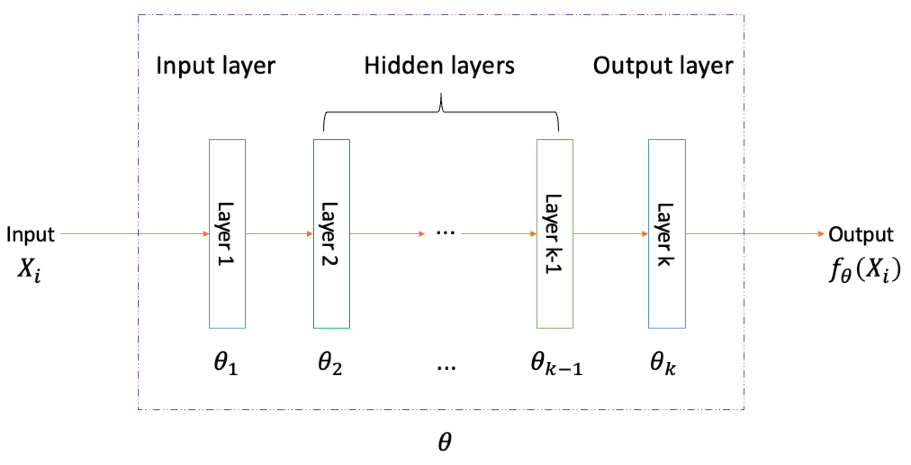
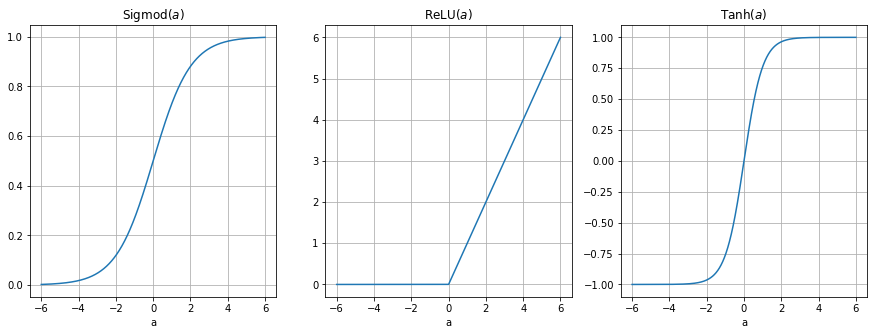
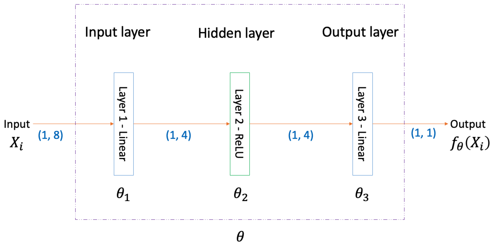
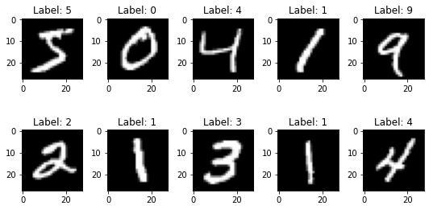
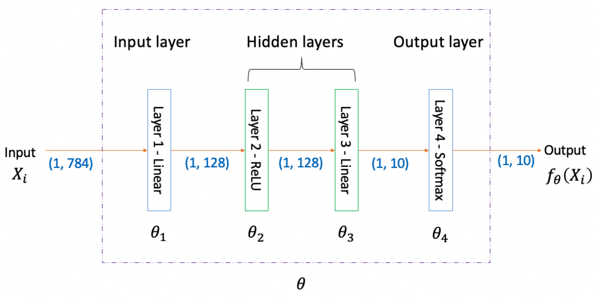
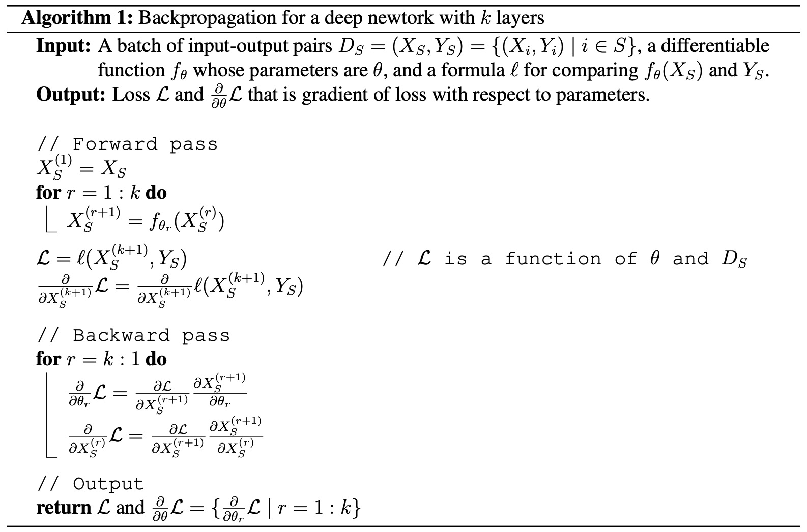
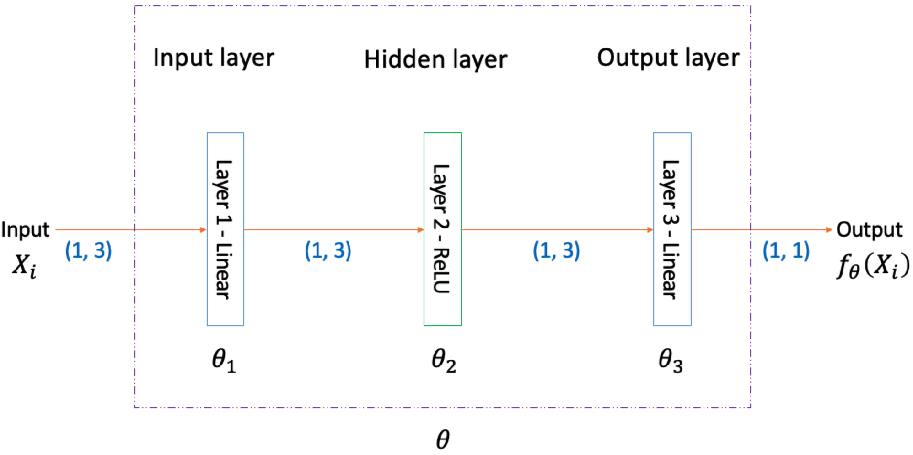

# Supervised Learning
{: .no_toc }

Table of Contents
{: .no_toc .text-delta }

1. TOC
{:toc}

## Supervised Learning: An Introduction with Examples

### Introduction

Machine learning is a technique that simulates the process of human learning and makes machines behave like or even beyond humans in some areas. Machines can learn from data and optimize their actions to meet a well-defined objective through machine learning algorithms. Machine learning can be divided into several categories depending on the data and objective.

In **supervised learning**, the data is labeled, which means it is a sequence of input-output pairs. The objective is to generate accurate outputs given new inputs. We often split the data into training and test data sets. The model is trained on the training set to find the optimal function that maps inputs to outputs. Then, we use the trained function to generate predicted outputs given inputs from the test set. The output can be either a category label (**classification**) or a number (**regression**). Regression is used for predicting outputs in the form of numbers given input data whereas classification is used for assigning input data to categories. The model is evaluated based on the comparison between predicted outputs and the real outputs in the test set.

By contrast, in **unsupervised learning**, the data is unlabeled, which means it only contains a sequence of inputs without corresponding targeted outputs. The objective is to find patterns in the unlabeled data. A good example of unsupervised learning is the clustering of counties by location. The location of counties is the unlabeled data and the clusters are the patterns in the location of counties. In addition to supervised and unsupervised learning, other kinds of machine learning include reinforcement learning, semi-supervised learning, etc.

### Example - Boston House Price Regression

Regression gives a predicted numerical output given an input that could be a scalar, a vector, etc. We will explain regression through a simple example where the input is a vector and the output is a real number.

**Data**

Suppose we have a data set that records Boston's house price. The input includes the house area and the house type. The house area is a numerical variable and the house type is a categorical variable. There are two possibilities of the house type: apartment and condo. We deal with categorical variables through one-hot encoding that encodes a categorical variable into a vector. In this case, there are two categories of the input variable, so the length of the vector of encoded categories is also two. If the house is an apartment, then the vector for house type is $$\left[\begin{array}{ll}1 & 0\end{array}\right]$$. If the house is a condo, then the vector for house type is $$\left[\begin{array}{ll}0 & 1\end{array}\right]$$. The house price data set after one-hot coding for the house type is stored in the table below and has three entries.

| HOUSE AREA | HOUSE TYPE (APARTMENT) | HOUSE TYPE (CONDO) | HOUSE PRICE |
|:----------:|:----------------------:|:-------------------:|:----------:|
| $$40$$     | $$1$$                  | $$0$$               | $$100$$    |
| $$50$$     | $$1$$                  | $$0$$               | $$125$$    |
| $$50$$     | $$0$$                  | $$1$$               | $$150$$    |

For simplicity, let us denote all the input entries of the data set by a matrix $$\mathbf{X}$$ where each row is an input entry. $$\mathbf{X}_{i,*}$$ is the $$i^{\text{th}}$$ row of the matrix, and we use a simpler notation $$\mathbf{X}_{i}$$ to represent the $$i^{\text{th}}$$ row of $$\mathbf{X}$$. Furthermore, $$\mathbf{X}_{i,j}$$ means the $$j^{\text{th}}$$ element in the $$i^{\text{th}}$$  row. For the data set in the table above, $$\mathbf{X}$$ should be:

$$
\mathbf{X} =
\begin{bmatrix}
\mathbf{X}_1 \\
\mathbf{X}_2 \\
\mathbf{X}_3
\end{bmatrix} =
\begin{bmatrix}
\mathbf{X}_{1,1} & \mathbf{X}_{1,2} & \mathbf{X}_{1,3} \\
\mathbf{X}_{2,1} & \mathbf{X}_{2,2} & \mathbf{X}_{2,3} \\
\mathbf{X}_{3,1} & \mathbf{X}_{3,2} & \mathbf{X}_{3,3}
\end{bmatrix} =
\begin{bmatrix}
40 & 1 & 0 \\
50 & 1 & 0 \\
50 & 0 & 1
\end{bmatrix}
$$

Similarly, let $$\mathbf{Y}$$ represent all the output entries of the data set, and $$\mathbf{Y}_i$$ is the $$i^{\text{th}}$$ output entry. For the data set in the table above, $$\mathbf{Y}$$ should be:

$$
\mathbf{Y} =
\begin{bmatrix}
\mathbf{Y}_1 \\
\mathbf{Y}_2 \\
\mathbf{Y}_3
\end{bmatrix} =
\begin{bmatrix}
100 \\
125 \\
150
\end{bmatrix}
$$

**Loss function for regression**

The goal of supervised learning is to train a function that maps an input to output. Let us denote the function by $$f$$. The question is how do we know $$f$$ is good? When we say $$f$$ is good, it implicitly means $$f$$ is good at something. For example, $$f$$ is good at predicting Boston's house price, but $$f$$ could not be good at predicting others at all. Thus, if we define a loss to evaluate $$f$$, the loss depends on both $$f$$ itself and the data set we use. Since $$f$$ is determined by its parameters, we can say the loss is a function of the parameters of $$f$$ and the data set.

Let us denote the parameters of $$f$$ by $$\theta$$, the data set by $$\mathcal{D}$$. $$\mathcal{D}$$ is a sequence of input-output pairs from $$\mathbf{X}$$ and $$\mathbf{Y}$$, and the length of $$\mathcal{D}$$ is $$N$$.The loss function for regression can be represented by $$\mathcal{L}_{\mathrm{R}}(\theta, \mathcal{D})$$. We often use mean squared error (MSE) as the loss function for regression problems.

$$
\mathcal{L}_\mathrm{R}(\theta, \mathcal{D}) =
\frac{1}{N} \sum_{i=1}^{N}(f_{\theta} (\mathbf{X}_{i}) - \mathbf{Y}_{i}) ^ 2
$$

$$f_{\theta} (\mathbf{X}_{i})$$ means the output of $$f$$ given input $$\mathbf{X}_i$$ and $$f$$ is determined by $$\theta$$.

### Example - Bob's Action Classification

Instead of predicting numerical outputs, classification models assign inputs to categories. The categorical output is one-hot encoded as a vector. You can consider the output as a discrete probability distribution that shows all possible categories along with the associated probabilities. We will explain classification through a multiclass classification example where the input is a vector and the output is a discrete probability distribution.

**Data**

Suppose we use the same inputs of Boston's house price data set but exchange the numerical outputs for categorical outputs. Let's say the categorical outputs represent a Rice student Bob's actions: rent, hesitate, and ignore. After one-hot coding for the house type and Bob's attitude, the house data set is stored in the table below and has three entries.

| HOUSE AREA | HOUSE TYPE (APARTMENT) | HOUSE TYPE (CONDO) | BOB (RENT) | BOB (HESITATE) | BOB (IGNORE) |
|:----------:|:----------------------:|:-------------------:|:----------:|:-------------:|:------------:|
| $$40$$     | $$1$$                  | $$0$$               | $$1$$      | $$0$$         | $$0$$        |
| $$50$$     | $$1$$                  | $$0$$               | $$0$$      | $$1$$         | $$0$$        |
| $$50$$     | $$0$$                  | $$1$$               | $$0$$      | $$0$$         | $$1$$        |

All the input entries in the data set can be represented by:

$$
\mathbf{X} =
\begin{bmatrix}
\mathbf{X}_1 \\
\mathbf{X}_2 \\
\mathbf{X}_3
\end{bmatrix} =
\begin{bmatrix}
\mathbf{X}_{1,1} & \mathbf{X}_{1,2} & \mathbf{X}_{1,3} \\
\mathbf{X}_{2,1} & \mathbf{X}_{2,2} & \mathbf{X}_{2,3} \\
\mathbf{X}_{3,1} & \mathbf{X}_{3,2} & \mathbf{X}_{3,3}
\end{bmatrix} =
\begin{bmatrix}
40 & 1 & 0 \\
50 & 1 & 0 \\
50 & 0 & 1
\end{bmatrix}
$$

The categorical output is one-hot encoded as a vector so each row of $$\mathbf{Y}$$ is a vector instead of a scalar. $$\mathbf{Y}_i$$ is the $$i^{\text{th}}$$ row of $$\mathbf{Y}$$ and $$\mathbf{Y}_{i,j}$$ means the $$j^{\text{th}}$$ element in the $$i^{\text{th}}$$ row. For the data set in the table above, $$\mathbf{Y}$$ should be:

$$
\mathbf{Y} =
\begin{bmatrix}
\mathbf{Y}_1 \\
\mathbf{Y}_2 \\
\mathbf{Y}_3
\end{bmatrix} =
\begin{bmatrix}
\mathbf{Y}_{1,1} & \mathbf{Y}_{1,2} & \mathbf{Y}_{1,3} \\
\mathbf{Y}_{2,1} & \mathbf{Y}_{2,2} & \mathbf{Y}_{2,3} \\
\mathbf{Y}_{3,1} & \mathbf{Y}_{3,2} & \mathbf{Y}_{3,3}
\end{bmatrix} =
\begin{bmatrix}
1 & 0 & 0 \\
0 & 1 & 0 \\
0 & 0 & 1
\end{bmatrix}
$$

**Loss function for classification**

We want a vector-valued function $$f$$ whose output $$f_{\theta} (\mathbf{X}_{i})$$ is the discrete probability distribution of Bob's action. $$f_{\theta} (\mathbf{X}_{i})_j$$ is the $$j^{\text{th}}$$ element of the vector $$f_{\theta} (\mathbf{X}_{i})$$ that represents the probability of the $$j^{\text{th}}$$ class. All $$f_{\theta}(\mathbf{X}_i)_j$$ should be a real number between $$0$$ and $$1$$ and they sum up to $$1$$. For example, $$f_{\theta} (\mathbf{X}_{i})$$ could be $$\left[\begin{array}{l} 0.7 & 0.2 & 0.1\end{array}\right]$$, which means Bob has a seventy percent chance to rent, a twenty percent chance to hesitate, and a ten percent chance to ignore.

The loss function for classification can be represented by $$\mathcal{L}_{\mathrm{C}}(\theta, \mathcal{D})$$. We often use mean [cross-entropy](https://en.wikipedia.org/wiki/Cross_entropy) as the loss function for classification problems.

$$
\mathcal{L}_\mathrm{C}(\theta, \mathcal{D})= - \frac{1}{N} \sum_{i=1}^{N}

\sum_{j} \mathbf{Y}_{i,j} \log f_{\theta} (\mathbf{X}_{i})_j
$$

$$-\sum_{j}\mathbf{Y}_{i,j}\log f_{\theta}(\mathbf{X}_i)_j$$ is the cross-entropy for the $$i^{\text{th}}$$ input-output pair. $$f_{\theta} (\mathbf{X}_i)$$ is a discrete probability distribution, and $$f_{\theta} (\mathbf{X}_i)_j$$ is the $$j^{\text{th}}$$ element of the discrete probability distribution. $$\mathcal{L}_\mathrm{C}(\theta, \mathcal{D})$$ averages the cross-entropy over the data set. Notice that for the $$i^{\text{th}}$$ input-output pair, there is only one element (suppose it is $$\mathbf{Y}_{i,j}$$) of $$\mathbf{Y}_{i}$$ is $$1$$, and all the remaining elements of $$\mathbf{Y}_{i}$$ are $$0$$. If the prediction $$f_{\theta} (\mathbf{X}_i)$$ is almost exactly the same as $$\mathbf{Y}_i$$, that is, $$f_{\theta} (\mathbf{X}_i)_j$$ is close to $$1$$, and all the remaining elements are close to $$0$$, the cross-entropy for the $$i^{\text{th}}$$ input-output pair will be close to $$0$$.

You may wonder why we use MSE in regression and mean cross-entropy in classification. The intuition is that we want to maximize the likelihood of the output in the data set given by the input and $$f$$. After a series of simplifications, we can get the loss functions like MSE and mean cross-entropy. You can take a look at [Probabilistic Machine Learning: An Introduction](https://probml.github.io/pml-book/book1.html) for more details.

**Training regression and classfication models**

There are various classes of $$f$$ that can be used for regression/classification. Linear models including linear regression, logistic regression, etc. are often applied to simple data sets. Linear regression is for regression and logistic regression is for classification, although its name contains "regression". Deep networks, on the other hand, are more powerful than linear models, especially when dealing with complex data sets, but deep networks take more time to train than linear models. Deep networks can be used for either regression or classification, depending on the structure of deep networks. We describe deep networks in section [Supervised Learning with Deep Networks](#supervised-learning-with-deep-networks).

Once we choose a class of $$f$$ and design its structure, what we need to do is to train its parameters $$\theta$$ by minimizing $$\mathcal{L}(\theta, \mathcal{D})$$ on the training set and evaluate $$f$$ on the test set. We will explain more details about optimization in section [Training Deep Networks](#training-deep-networks).

## Supervised Learning with Deep Networks

### Revision of Supervised Learning

Let us revise supervised learning before we start to explain how to use deep networks for supervised learning. Supervised learning aims to have a function to fit a sequence of input-output pairs called labeled data. The input can be a digital form of anything. For example, the pixel values of a gray-scale image are saved in a two-dimensional matrix. The features of a house, such as its area and type can be saved in a vector. The output can be a number for regression or a category label for classification. The function that maps an input to an output is determined by its parameters, and we train its parameters by minimizing the loss of the function on the training data set. Before training the parameters of a function, we need to design the structure of the function.

Here are the notations we used in the previous section:

- Labeled data - $$\mathcal{D}$$
- All the input entries of labeled data - $$\mathbf{X}$$
- All the output entries of labeled data - $$\mathbf{Y}$$
- The function that maps an input to output - $$f$$
- All the parameters of the function - $$\theta$$
- Loss function - $$\mathcal{L}$$

### Deep Networks

Deep networks, inspired by human brains, belong to a highly effective class of functions. Basically, deep networks can approximate anything that can be expressed as a function to any level of accuracy, which is why deep networks are considered [universal approximators](https://www.sciencedirect.com/science/article/pii/0893608089900208). In this part, we will talk about how deep networks work. There are two factors that determine a deep network's properties: its structure and its parameters.

Deep networks consist of multiple layers, and each layer must be a differentiable function. We compose layers into any kind of [directed acyclic graph](https://en.wikipedia.org/wiki/Directed_acyclic_graph), mapping input to output. In other words, the structure of deep networks is a directed acyclic graph consisting of differentiable layers. The simplest structure of deep networks is a chain with layers connected sequentially, which is also called multi-layer perceptron (MLP). Suppose a MLP has $$k$$ layers and let us denote the parameters of the function at the $$k^{\text{th}}$$ layer by $$\theta_k$$, the function at the $$k^{\text{th}}$$ layer by $$f_{\theta_k}$$. Then, we get:

$$
f_{\theta}(\mathbf{X}_i) = f_{\theta_k}

(f_{\theta_{k-1}} (\cdots(f_{\theta_1} (\mathbf{X}_i)) \cdots))
$$

After we design the structure of a deep network, the total number of its parameters is fixed. A deep network has multiple layers, and each layer has its parameters except that some types of layers do not have parameters. The parameters of a deep network include the parameters at each layer.

$$
\theta=(\theta_1, \theta_2, \cdots, \theta_k)
$$

  

Here is a visualization of a deep network consisting of a chain of layers. We name the first layer as the input layer, the last layer as the output layer, and the middle layers as hidden layers. The deep network receives input data in the input layer and produces the output after the output layer. The layers in the deep network are sequentially connected, and the previous layer's output is the next layer's input. The output of the last layer is the output of the deep network.

### Types of Layers

Now we know the structure (how layers are connected) and parameters are the two factors that affect the properties of a deep network. In this part, we will introduce two common types of layers: linear and activation. We will explain how linear layers and activation layers work and their parameters.

**Linear layers**

Linear layers map a vector in one vector space to another vector space. The input is a row vector in $$M_1$$-dimensional space, and the output is a row vector in $$M_2$$-dimensional space. A linear layer multiplies the input row vector by a weight matrix whose shape is $$M_1$$ by $$M_2$$ and adds a bias row vector whose shape is $$1$$ by $$M_2$$. Let us say we have a linear layer at the $$k^{\text{th}}$$ layer of the deep network, so its parameters $$\theta_k$$ includes a weight matrix $$\mathbf{W}_k$$ and a bias vector $$\mathbf{b}_k$$.

$$
\theta_k = (\mathbf{W}_k, \mathbf{b}_k)
$$

If the input row vector is $$\mathbf{X}_i$$, then the linear layer implements a transformation like this:

$$
f_{\theta_{k}}\left(\mathbf{X}_{i}\right) = \mathbf{X}_{i}\mathbf{W}_k + \mathbf{b}_k
$$

Notice that If multiple linear layers are connected sequentially, the effect is equivalent to only one linear layer. For regression problems, a linear layer that maps a vector to a scalar can be used as the output layer of a deep network.

**Activation layers (nonlinearity)**

There are two purposes of activation layers in deep networks. One purpose is to add nonlinearity, which allows deep networks to increase their depth so that they can be much more powerful as the later layers can leverage the features that are learned by earlier layers. The other purpose is to generate probability scores at the output layer of the deep network if the task is a classification problem.

The first purpose of activation layers is to add nonlinearity. In this case, the input of activation layers can be a scalar, a vector, a matrix in two-dimensional space, or a matrix in high-dimensional space. The activation layers perform an element-wise transformation to the input with a vectorized nonlinear activation function, so the output has the same shape as the input. Common non-linear activation functions for adding nonlinearity include Sigmoid, Tanh, and ReLU. Let us denote Sigmoid by $$\sigma$$, Tanh by $$\tau$$, and ReLU by $$\rho$$. If we have a scalar input $$a$$, then we have:

$$
\sigma(a) =\frac{1}{1+e^{-a}}
$$

$$
\tau(a) = \frac{e^{a}-e^{-a}}{e^{a}+e^{-a}}
$$

$$
\rho(a) =
\left\{\begin{array}{ll}0 & a<0 \\ a & a \geq 0\end{array}\right.
$$

Here is a visualization of Sigmod, Tanh, and ReLU when the input is a scalar. You can find that the value of Sigmod's output is centered at $$0.5$$ and always between $$0$$ and $$1$$. Tanh, on the other hand, its output value is centered at $$0$$ and always between $$-1$$ and $$1$$. The similarity between Sigmod and Tanh is their derivatives are small when $$a$$ is small or large. Also, they both need to compute exponential functions. Different from Sigmod and Tanh, ReLU does not need to compute exponential functions, and ReLU's derivative is always $$1$$ if $$a$$ is positive, and always $$0$$ if $$a$$ is negative. If $$a$$ equals $$0$$, the [subderivative](https://en.wikipedia.org/wiki/Subderivative) of ReLU is any value between $$0$$ and $$1$$ inclusive, and it is often taken to be $$0$$.

  

Now we know what the common vectorized nonlinear activation functions look like if the input is a scalar. Let us say there is an input row vector $$\mathbf{X}_{i}=\left[\begin{array}{l} 43 & 5 & -5 & 46\end{array}\right]$$ for an activation layer whose vectorized nonlinear activation function is ReLU. Then, the output of the activation layer should be:

$$
\rho(\left[\begin{array}{l} 43 & 5 & -5 & 46 \end{array}\right]) =
\left[\begin{array}{l} \rho(43) & \rho(5) & \rho(-5) & \rho(46) \end{array}\right] =
\left[\begin{array}{l} 43 & 5 & 0 & 46 \end{array}\right]
$$

**Activation layers (probability scores)**

The second purpose of an activation layer is to be the output layer of a deep network to generate a probability score for classification problems. In this case, the input of the activation layer should be either a scalar (binary classification) or a vector (multiclass classification). For binary classification problems, we use Sigmoid to map the scalar real number input between negative infinity and positive infinity to a scalar real number output between $$0$$ and $$1$$ exclusive, which is the probability score. For multiclass classification problems, if the number of classes is $$M$$, then the input of the activation layer is a vector with $$M$$ elements, and we use Softmax to map the vector in $$M$$-dimensional space to a discrete probability distribution with length $$M$$.

Unlike vectorized nonlinear activation functions for adding nonlinearity, as the output layer of a deep network for multiclass classification problems, Softmax does **not** perform an element-wise transformation to the input vector. Instead, Softmax sums up all the exponentials of the numbers in the input vector and uses the sum to divide each exponential. As a result, the input vector in $$M$$-dimensional space is normalized to a discrete probability distribution consisting of $$M$$ elements. Let us denote Softmax by $$\mu$$. If the input vector is $$\mathbf{X}_i$$ with the length $$M$$, then $$\mu(\mathbf{X}_{i})$$ is the discrete probability distribution consists of $$M$$ elements:

$$
\mu(\mathbf{X}_{i})=\frac{1}{\sum(e^{\mathbf{X}_{i}}) }e^{\mathbf{X}_{i}} = \left[\begin{array}{l}
\frac{1}{\sum(e^{\mathbf{X}_{i}}) }e^{\mathbf{X}_{i,1}} &
\cdots &
\frac{1}{\sum(e^{\mathbf{X}_{i}}) }e^{\mathbf{X}_{i,M}}
\end{array}\right]
$$

And we define:

$$
\sum(e^{\mathbf{X}_i})=\sum_{j=1}^{M} e^{\mathbf{X}_{i,j}}
$$

While Sigmoid can be used as a vectorized nonlinear activation function for adding nonlinearity, it can also be used as the output layer of a deep network for binary classification problems, and the input must be a scalar.

$$
\sigma(a) =\frac{1}{1+e^{-a}}
$$

Suppose we have a scalar $$a=0$$ as the input of the activation layer (Sigmoid) which is also the output layer of a deep network for binary classification, and a vector $$\mathbf{X}_{i} = \left[\begin{array}{l} 43 & 5 & 0 & 46 \end{array}\right]$$ as the input of the activation layer (Softmax) which is also the output layer of a deep network for multiclass classification.

$$
\sigma(0) = \frac{1}{1 + e^{-0}} = 0.50
$$

$$
\mu(\left[\begin{array}{l}
43 & 5 & 0 & 46
\end{array}\right])=\frac{1}{\sum(e^{\left[\begin{array}{l}
43 & 5 & 0 & 46
\end{array}\right]}) }e^{\left[\begin{array}{l}
43 & 5 & 0 & 46
\end{array}\right]}

 \approx
\left[\begin{array}{l}
0.05 & 0.00 & 0.00 & 0.95
\end{array}\right]
$$

We get a probability score equal to $$0.50$$ for the binary classification problem, and a discrete probability distribution whose elements are roughly equal to $$0.05$$, $$0.00$$, $$0.00$$, and $$0.95$$ for the multiclass classification problem.

**Note**: The operation of an activation layer is fixed if the type of the non-linear activation function is chosen. Activation layers do not have trainable parameters. If the activation layer is the $$k^{\text{th}}$$ layer of a deep network, then $$\theta_{k}$$ includes nothing.

### Example - California House Price Regression with Deep Networks

Deep networks can be used for regression if the output layer is a linear layer that maps a vector to a scalar. In this example, we will design a deep network for regression to predict California house prices.

**Data**

In section [Example - Boston House Price Regression](#example---boston-house-price-regression), we make up a simple data set of Boston house prices. There is a real data set about Boston house prices and you can take a look at the details from [here](https://www.cs.toronto.edu/~delve/data/boston/bostonDetail.html). However, the Boston house price data set only has around five hundred entries, which is not quite enough for a deep network.

We use the California house price data set ([link](https://scikit-learn.org/stable/modules/generated/sklearn.datasets.fetch_california_housing.html)) that has $$20640$$ entries, and each entry has $$8$$ numerical features and $$1$$ numerical output. All the input entries of the data set can be saved to $$\mathbf{X}$$ that has $$20640$$ rows and $$8$$ columns. All the output entries of the data set can be saved to $$\mathbf{Y}$$ that has $$20640$$ rows and $$1$$ column.

**Deep networks for regression**

We want to have a deep network whose output layer is a linear layer that maps a vector to a scalar. The deep network input is a row vector with $$8$$ elements, and the output is a real number representing the predicted house price. Here is our design of the structure of the deep network. You can see how the shape of the original input changes after each layer.

    

Our deep network has three layers, one linear layer as the input layer, one activation layer using ReLU as the hidden layer, and one linear layer as the output layer. The first linear layer maps a vector in $$8$$-dimensional space to $$4$$-dimensional space, so its weight matrix's shape is $$8$$ by $$4$$, and its bias vector's shape is $$1$$ by $$4$$. The activation layer element-wise transforms the output of the first linear layer by ReLU. The last linear layer maps the output of the activation layer, a vector whose shape is $$1$$ by $$4$$, to a scalar. Its weight matrix's shape is $$4$$ by $$1$$, and its bias vector's shape is $$1$$ by $$1$$.

### Example - Handwritten Digit Classification with Deep Networks

We will help you understand deep networks more with an example of handwritten digit classification. The goal is to design a deep network that can recognize handwritten digits. Based on the image of a handwritten digit, the deep network should be able to tell which digit that image belongs to. For multiclass classification problems, the output layer of the deep network should be a softmax activation layer.

**Data**

The [MNIST](http://yann.lecun.com/exdb/mnist/) data set is a database that has a training data set of $$60000$$ examples, and a test data set of $$10000$$ examples. Each example is a $$28$$ by $$28$$ grayscale labeled image of handwritten digits. Here is the visualization of some examples in the data set. The value of each pixel ranges from $$0$$ to $$255$$.

    

**Deep networks for classification**

We want to construct a deep network with linear and activation layers. However, each input entry in the data set is a gray-scale image (two-dimensional matrix), not a vector. Therefore, we need to first flatten the $$28$$ by $$28$$ matrix into a vector with $$784$$ elements. All the flattened images in the data set can be saved to $$\mathbf{X}$$ that has $$70000$$ rows and $$784$$ columns. All the output entries of the data set can be saved to $$\mathbf{Y}$$ that has $$70000$$ rows and $$10$$ columns, as there are ten categories of digits.

Then, we can design a deep network as shown in the figure below. You can see how the shape of the original input changes after each layer. The input layer is a linear layer whose weight matrix is $$784$$ by $$128$$, bias vector is $$1$$ by $$128$$. The second layer is an activation layer that uses ReLU to element-wise transform the output after the first layer. The third layer is a linear layer with a weight matrix of $$128$$ by $$10$$ and a bias vector of $$1$$ by $$10$$. The output layer is an activation layer that uses Softmax to map the $$1$$ by $$10$$ vector after the third layer to a discrete probability distribution with $$10$$ elements that sum up to $$1$$. Each element represents the probability of the input image being the corresponding digit.

    

Now we have the deep network's structure and need to optimize the parameters in all the layers (some layers like activation layers do not have parameters). Recall that the essence of optimizing the parameters $$\theta$$ of a function $$f$$ is to minimize $$\mathcal{L}(\theta, \mathcal{D})$$ on the training data set. We will talk about how to train the parameters of a deep network in section [Training Deep Networks](#training-deep-networks).

## Training Deep Networks

### Revision of Supervised Learning with Deep Networks

We introduced supervised learning and deep networks in the previous pages. The goal of supervised learning is to find a function mapping an input to output with minimal loss. A deep network can be considered as a function with parameters, and it maps an input to an output that is either a number (regression) or a probability distribution (classification). The properties of a deep network are determined by its structure (how layers are connected) and its parameters. After we design the structure of a deep network, we need to train its parameters by minimizing the loss of the deep network on the training data set and evaluate the performance of the deep network on the test data set. Here are the notations we used in the previous pages.

- Labeled data - $$\mathcal{D}$$
- All the input entries of labeled data - $$\mathbf{X}$$
- All the output entries of labeled data - $$\mathbf{Y}$$
- The function that maps an input to output - $$f$$
- All the parameters of the function - $$\theta$$
- Loss function - $$\mathcal{L}$$

### Optimization Algorithms: Gradient Descent and Its Variants

We know that the essence of training $$\theta$$ of $$f$$ is to minimize $$\mathcal{L}(\theta, \mathcal{D})$$ on the training data set. Recall that the commonly used loss function for regression is mean squared error:

$$
\mathcal{L}_{\mathrm{R}}(\theta, \mathcal{D})=\frac{1}{N} \sum_{i=1}^{N}\left(f_{\theta}\left(\mathbf{X}_{i}\right)-\mathbf{Y}_{i}\right)^{2}
$$

The commonly used loss function for multiclass classification is mean cross-entropy:

$$
\mathcal{L}_{\mathrm{C}}(\theta, \mathcal{D})= - \frac{1}{N} \sum_{i=1}^{N} \sum_{j} \mathbf{Y}_{i, j} \log f_{\theta}\left(\mathbf{X}_{i}\right)_{j}
$$

So how do find the value of $$\theta$$ that minimizes $$\mathcal{L}(\theta, \mathcal{D})$$? If $$\mathcal{L}(\theta, \mathcal{D})$$ is convex, we can compute the value of $$\theta$$ to make $$\frac{\partial}{\partial\theta}\mathcal{L}(\theta, \mathcal{D})$$, which is the the gradient of $$\mathcal{L}(\theta, \mathcal{D})$$ with respect to $$\theta$$, equal to zero, and that point is the global minimum. However, in most cases, $$\mathcal{L}(\theta, \mathcal{D})$$ is not convex and it is hard to calculate the value of $$\theta$$ to make $$\frac{\partial}{\partial\theta}\mathcal{L}(\theta, \mathcal{D})$$ equal to zero unless $$\mathcal{L}(\theta, \mathcal{D})$$ is simple, such as a quadratic function. Therefore, we prefer to use an iterative algorithm to minimize $$\mathcal{L}(\theta, \mathcal{D})$$.

**Gradient descent**

Gradient descent is an efficient iterative algorithm to find a local minimum of a differentiable function. As implicated by the name of the algorithm, gradient descent requires the gradient of the objective function with respect to the trainable parameters. We can use gradient descent to train $$\theta$$ of $$f$$ because $$\mathcal{L}(\theta, \mathcal{D})$$ is differentiable with respect to $$\theta$$.

The number of epochs is the times the machine learning algorithm works through the entire training data set. Starting with an initial guess of $$\theta$$, gradient descent updates the value of $$\theta$$ in each epoch by $$\theta:=\theta-\eta \frac{\partial}{\partial\theta}\mathcal{L}(\theta, \mathcal{D})$$ where $$\eta$$ is the step size.

The value of $$\eta$$ should be in a proper range because if $$\eta$$ is too small, it will take a long time to find a local minimum whereas if $$\eta$$ is too large, $$\theta$$ will repeatedly jump over the local minimum that we are trying to reach. If $$\eta$$ is in a proper range, $$\mathcal{L}(\theta, \mathcal{D})$$ will converge to a local minimum after a number of epochs in a reasonably short time.

Notice that the gradient descent algorithm can find a local minimum of the loss function but it does not guarantee (mostly not) that the local minimum is the global minimum. Fortunately, it does not matter if we use the local minimum because local minimums are very rare when $$f$$ has a lot of parameters and they are similar to each other and the global minimum. You can take a look at this [paper](https://arxiv.org/pdf/1412.0233.pdf) for more details.

**Stochastic gradient descent**

The gradient algorithm needs $$\frac{\partial}{\partial\theta}\mathcal{L}(\theta, \mathcal{D})$$ to update the value of $$\theta$$ in each epoch. However, if the data set is very large, it will need a lot of time and memory to compute $$\frac{\partial}{\partial\theta}\mathcal{L}(\theta, \mathcal{D})$$ on the entire training data set. [Stochastic gradient descent](https://en.wikipedia.org/wiki/Stochastic_gradient_descent) is a variant of gradient descent. Similar to gradient descent, stochastic gradient descent also has some epochs where each epoch takes advantage of the entire data set. However, stochastic gradient descent divides each epoch into a number of iterations and updates parameters in each iteration of an epoch.

Specifically, stochastic gradient descent randomly picks one instance of the training data set, and lets us denote the randomly picked instance of $$\mathcal{D}$$ by $$\mathcal{D}_i$$.

$$
\mathcal{D}_i = (\mathbf{X}_{i},\mathbf{Y}_{i})
$$

As we explained earlier, the loss depends on both the deep network's parameters and the data set we use if the structure of the deep network is fixed. Stochastic gradient descent calculates the gradient of the loss on $$\mathcal{D}_i$$, which is $$\frac{\partial}{\partial\theta}\mathcal{L}(\theta, \mathcal{D}_i)$$, to update the parameters $$\theta$$ in each iteration of an epoch by the following:

$$
\theta:=\theta-\eta \frac{\partial}{\partial\theta}\mathcal{L}(\theta, \mathcal{D}_i)
$$

In an epoch, all the examples in the data set should be used exactly once, which means if the data set $$\mathcal{D}$$ has $$N$$ examples, then there are $$N$$ iterations of each epoch. The way to do this is, we randomly shuffle the indices of the examples in the data set before the start of each epoch, and pick those examples one by one in each iteration of the epoch to calculate the gradient and update the parameters.

After some epochs of training by stochastic gradient descent, the training loss can approximately converge to a local minimum. Although the calculated gradient used by stochastic gradient descent is a rough approximation of the gradient for the entire training set, the result of stochastic gradient descent is almost as good as gradient descent in terms of training loss.

Batch gradient descent is very similar to stochastic gradient descent because it also has some epochs and divides each epoch into some iterations. But the difference is that it randomly picks a subset of $$\mathcal{D}$$ (we call it a batch) rather than only one instance, and use the subset to calculate the gradient for updating $$\theta$$ in each iteration of an epoch. Let us denote the subset of $$\mathcal{D}$$ by $$\mathcal{D}_S$$.

$$
\mathcal{D}_S=\{ {\mathcal{D}_i} \mid i \in S \}
$$

$$S$$ is a subset of indices of the examples in $$\mathcal{D}$$. In each iteration of an epoch, batch gradient descent updates parameters by the following:

$$
\theta:=\theta-\eta \frac{\partial}{\partial\theta}\mathcal{L}(\theta, \mathcal{D}_S)
$$

The subset $$\mathcal{D}_S$$ should be randomly picked from $$\mathcal{D}$$ without replacement. The number of examples in $$\mathcal{D}_S$$ is called batch size. You can consider gradient descent as a special case of batch gradient descent where the batch size is $$N$$ ($$\mathcal{D}$$  has $$N$$ examples) and each batch has $$1$$ iteration. Stochastic gradient descent, on the other hand, is batch gradient descent where the batch size is $$1$$ and each batch has $$N$$ iterations. Same as stochastic gradient descent, batch gradient descent can also make the training loss approximately converge to a local minimum after some epochs.

### Backpropagation

[Backpropagation](https://en.wikipedia.org/wiki/Backpropagation) is an efficient algorithm to compute $$\mathcal{L}(\theta, \mathcal{D}_S)$$ and $$\frac{\partial}{\partial\theta}\mathcal{L}(\theta, \mathcal{D}_S)$$ for an iteration of an epoch in batch gradient descent. Batch gradient descent requires the value of $$\frac{\partial}{\partial\theta}\mathcal{L}(\theta, \mathcal{D}_S)$$, and batch gradient descent can be converted to gradient descent and stochastic gradient descent depending on the size of $$\mathcal{D}_S$$.

We explained earlier how a deep network with multiple layers connected as a chain works. For an input $$\mathbf{X}_i$$, the prediction of the deep network with $$k$$ layers connected as a chain is,

$$
f_{\theta}(\mathbf{X}_i) = f_{\theta_{k}}(f_{\theta_{k-1}} (\cdots(f_{\theta_{1}} (\mathbf{X}_i)) \cdots))
$$

where $$\theta=(\theta_1, \theta_2, \cdots, \theta_k)$$. We can define $$\mathbf{X}_S=\{ {\mathbf{X}_i} \mid i \in S \}$$ and $$Y_S=\{ {\mathbf{Y}_i} \mid i \in S \}$$ so that $$\mathcal{D}_S= (\mathbf{X}_S, Y_S) = \{ (\mathbf{X}_i, \mathbf{Y}_i) \mid i \in S \}$$. If we have $$\mathbf{X}_S$$ as the input of $$f_\theta$$, then the output is a batch of predictions.

$$
f_{\theta}(\mathbf{X}_S) = \{ f_{\theta}(\mathbf{X}_i) \mid i \in S \}
$$

Suppose the formula for comparing $$f_{\theta}(\mathbf{X}_{{S}})$$ and $$Y_S$$ is $$\ell$$ (we explained mean squared error and mean cross-entropy), then the loss $$\mathcal{L}(\theta, \mathcal{D}_S)$$ is as follows:

$$
\mathcal{L}(\theta, \mathcal{D}_S) = \ell (f_{\theta}(\mathbf{X}_S) , Y_S)
$$

The gradient of $$\mathcal{L}(\theta, \mathcal{D}_S)$$ with respect to each layer's parameter for a deep network with $$k$$ layers can be expressed as:

$$
\frac{\partial}{\partial\theta}\mathcal{L}(\theta, \mathcal{D}_S) = \{ \frac{\partial}{\partial\theta_r}\mathcal{L}(\theta, \mathcal{D}_S) \mid r=1:k \}
$$

Here is the pseudocode of backpropagation for a chain deep network with $$k$$ layers. For simplicity, let us denote the input of the $$r^{\text{th}}$$ layer by $$\mathbf{X}_S^{(r)}$$, the output of the $$r^{\text{th}}$$  layer by $$\mathbf{X}_S^{(r+1)} = f_{\theta_{r}}(\mathbf{X}_S^{(r)})$$, and the prediction of the deep network by $$\mathbf{X}_S^{(k+1)} = f_{\theta_{k}}(\mathbf{X}_S^{(k)}) = f_{\theta}(\mathbf{X}_S)$$ because it is the output of the last layer. The formula for comparing $$f_{\theta}(\mathbf{X}_S)$$ and $$Y_S$$ is $$\ell$$.

    

In section [Computing Deep Networks by Hand](#computing-deep-networks-by-hand), we will compute deep networks by hand to help you understand more about backpropagation.

### Accessing the Quality of Deep Networks

We train the parameters $$\theta$$ of $$f$$ by minimizing $$\mathcal{L}(\theta, \mathcal{D})$$ on the training data set. However, $$f$$ should be evaluated by $$\mathcal{L}(\theta, \mathcal{D})$$ on the test data set. It is possible that the training error is small whereas the test error is large. This phenomenon is called overfitting. The reason for overfitting is that $$f$$ is so complex that it almost memorizes the training data. The figure ([source](https://www.d2l.ai/chapter_multilayer-perceptrons/underfit-overfit.html)) below shows the relation between model complexity and train and test (generalization) loss. To avoid overfitting, you can try to decrease the complexity of $$f$$. Some deep learning models are exceptions because [recent studies](https://iopscience.iop.org/article/10.1088/1742-5468/ac3a74/pdf) show that they exhibit a double-descent phenomenon, that is, as we increase the model complexity, the test loss first increases and then decreases.

    

## Computing Deep Networks by Hand

### Structure of Our Deep Network

We will calculate a simple deep network for regression and optimize its parameters by hand to enhance your understanding of deep networks. Our deep network is designed to map a row vector with three elements to a scalar. The deep network has three layers connected as a chain, and its structure is shown in the figure below.

    

$$
f_{\theta}(\mathbf{X}_i)=f_{\theta_3}(f_{\theta_2}(f_{\theta_1}(\mathbf{X}_i)))
$$

$$
\theta=(\theta_1,\theta_2,\theta_3)
$$

The first layer is a linear layer that maps a row vector in $$3$$-dimensional space to $$3$$-dimensional space. Its weight matrix $$\mathbf{W}_1$$ has $$3$$ rows and $$3$$ columns, and its bias row vector $$\mathbf{b}_1$$ has $$3$$ elements. The second layer is an activation layer so $$\theta_2$$ contains nothing. The third layer is a linear layer that maps a row vector in $$3$$-dimensional space to $$1$$-dimensional space. Its weight matrix $$\mathbf{W}_3$$ is $$3$$ by $$1$$, and its bias row vector $$\mathbf{b}_1$$ has $$1$$ element.

$$
\theta_1 = (\mathbf{W}_1, \mathbf{b}_1)
$$

$$
\theta_2 = \varnothing
$$

$$
\theta_3 = (\mathbf{W}_3, \mathbf{b}_3)
$$

In the following part, we will use batch gradient descent to optimize the parameters of our deep network.

### Batch Gradient Descent

We use batch gradient descent to train our deep network. As we explained earlier, batch gradient descent has some epochs, and each epoch is divided into a number of iterations. The number of epochs is the times the machine learning algorithm works through the entire training data set. Starting with an initial guess of $$\theta$$, batch gradient descent updates $$\theta$$ in each iteration of an epoch by $$\theta:=\theta-\eta \frac{\partial}{\partial \theta}\mathcal{L}(\theta, \mathcal{D}_S)$$ where $$\mathcal{D}_S$$ is a random subset of the training data set $$\mathcal{D}$$ (containing $$N$$ input-output pairs) without replacement.

**Phase 1 - Initialization**

Before the batch gradient descent training loop starts, we should do the following four things.

- Set the number of epochs
- Set a batch size $$N_S$$
- Set a formula $$\ell$$ for comparing $$f_{\theta}(\mathbf{X}_S)$$ and $$Y_S$$
- Initialize $$\theta$$

**Phase 2 - Loop by epochs**

In this phase, we should loop by epochs until the number of epochs reaches the predefined number of epochs. Each epoch has a number of iterations depending on the batch size, and we update $$\theta$$ in each iteration.

***Step 1 - Starting an epoch***

At the beginning of an epoch, the indices of examples in $$\mathcal{D}$$ should be randomly shuffled. Then, $$\mathcal{D}$$ can be split into some batches and each batch has a fixed batch size. For example, if the batch size is $$N/10$$, then there are $$10$$ batches in an epoch. $$\mathcal{D}_S = (\mathbf{X}_S, Y_S)$$ is a batch of $$\mathcal{D}$$, and we know $$\mathbf{X}_i$$ is a row vector with three elements. $$\mathbf{X}_S$$ can be considered as a matrix that has $$N_S$$ rows, and each row is $$\mathbf{X}_i$$ where $$i \in S$$. $$Y_S$$ can be considered as a column vector with $$N_S$$ elements, and each element is $$\mathbf{Y}_i$$ where $$i \in S$$. In addition to shuffling and splitting the data set, we should also read the current value of $$\theta$$.

***Step 2 - Loop by iterations***

We have $$N/N_S$$ batches of data, and each batch is used for an iteration in the current epoch. In each iteration, we update $$\theta$$ by $$\theta:=\theta-\eta \frac{\partial}{\partial \theta}\mathcal{L}(\theta, \mathcal{D}_S)$$ where $$\mathcal{D}_S = (\mathbf{X}_S, Y_S)$$ is the batch of data for the corresponding iteration. We will explain the mathematical structure of an iteration as follows.

***Step 2.1 - Starting an iteration***

At the beginning of an iteration, we should know which batch of data we are going to use. Let us say we use $$\mathcal{D}_S = (\mathbf{X}_S, Y_S)$$. Also, we should read the current value of parameters $$\theta$$.

***Step 2.2 - Backpropagation: forward pass***

In this step, we do the forward pass of backpropagation for our deep network with $$\mathbf{X}_S$$ as the input.

$$
\mathbf{X}_S^{(1)} = \{\mathbf{X}_i \mid i \in S \} =

\left[\begin{array}{c}

\vdots \\ \mathbf{X}_{i \in S} \\ \vdots

\end{array}\right]
$$

$$
\mathbf{X}_S^{(2)}  = f_{\theta_{1}}(\mathbf{X}_S^{(1)} ) = \{   \mathbf{X}_i^{(1)}   \mathbf{W}_1 + \mathbf{b}_1  \mid i \in S \} =
\left[\begin{array}{c}

\vdots \\ \mathbf{X}_{i \in S} ^{(1)}   \mathbf{W}_1 + \mathbf{b}_1  \\ \vdots

\end{array}\right]
$$

$$
\mathbf{X}_S^{(3)}  = f_{\theta_{2}} ( \mathbf{X}_S^{(2)}  ) = \{

\rho ( \mathbf{X}_i^{(2)} ) \mid i \in S \} =

\left[\begin{array}{c}

\vdots \\ \rho ( \mathbf{X}_{i \in S}^{(2)} )  \\ \vdots

\end{array}\right]
$$

$$
\mathbf{X}_S^{(4)}  = f_{\theta_{3}}(\mathbf{X}_S^{(3)} ) = \{   \mathbf{X}_i^{(3)}   \mathbf{W}_3 + \mathbf{b}_3  \mid i \in S \} =

\left[\begin{array}{c}

\vdots \\ \mathbf{X}_{i \in S} ^{(3)}   \mathbf{W}_3 + \mathbf{b}_3  \\ \vdots

\end{array}\right]
$$

Here $$\mathbf{X}_S^{(4)}$$ is the predictions of our deep network with $$3$$ layers as it is the output of the last layer. Then, we should compute the value of $$\mathcal{L}$$ with mean squared error. Notice that here $$\mathcal{L}$$ is a function of $$\theta$$ and $$\mathcal{D}_S$$.

$$
\mathcal{L} = \ell

(\mathbf{X}_S^{(4)}, Y_S) = \frac{1}{N_S} \sum_{i \in S} (\mathbf{X}_i^{(4)} - \mathbf{Y}_i) ^ 2
$$

We should also compute the value of the gradient of $$\mathcal{L}$$ with respect to $$\mathbf{X}_S^{(4)}$$ to finish forward pass.

$$
\frac{\partial}{\partial \mathbf{X}_S^{(4)} } \mathcal{L}=

\frac{\partial}{\partial \mathbf{X}_S^{(4)} } \ell\left(\mathbf{X}_S^{(4)} , Y_S \right)

= \{ \frac{2}{|S|}  (\mathbf{X}_i^{(4)} -  \mathbf{Y}_i)  \mid i \in S \} =

\left[\begin{array}{c}

\vdots \\ \frac{2}{N_S}  (\mathbf{X}_{i \in S}^{(4)} -  \mathbf{Y}_{i \in S}) \\ \vdots

\end{array}\right]
$$

***Step 2.3 - Backpropagation: backward pass***

Backward pass computes $$\frac{\partial}{\partial \theta} \mathcal{L}=\left\{\frac{\partial}{\partial \theta_{r}} \mathcal{L} \mid r=1:k\right\}$$ by the [chain rule](https://en.wikipedia.org/wiki/Chain_rule) in Calculus in the reverse order of forward pass. First, let $$k$$ equal $$3$$ and we compute the gradient of $$\mathcal{L}$$ with respect to $$\theta_3$$ where $$\theta_3 = (\mathbf{W}_3, \mathbf{b}_3)$$. Specifically, we calculate $$\frac{\partial}{\partial \theta_{3}} \mathcal{L}= (\frac{\partial}{\partial \mathbf{W}_3} \mathcal{L}, \frac{\partial}{\partial \mathbf{b}_3 } \mathcal{L})$$.

$$
\frac{\partial}{\partial \mathbf{W}_3} \mathcal{L} =
\frac{\partial \mathcal{L}}{\partial \mathbf{X}_S^{(4)}} \frac{\partial \mathbf{X}_S^{(4)}}{\partial \mathbf{W}_3} =  
{\mathbf{X}_S^{(3)}} ^{\top} \frac{\partial \mathcal{L}}{\partial \mathbf{X}_S^{(4)}}
$$

$$
\frac{\partial}{\partial \mathbf{b}_3} \mathcal{L} = \frac{\partial \mathcal{L}}{\partial \mathbf{X}_S^{(4)}} \frac{\partial \mathbf{X}_S^{(4)}}{\partial \mathbf{b}_3} = \frac{1}{|S|}
\overrightarrow{1} \frac{\partial \mathcal{L}}{\partial \mathbf{X}_S^{(4)}}
$$

$$\overrightarrow{1} $$ is an all-ones row vector. We also need to calculate $$\frac{\partial}{\partial \mathbf{X}_S^{(3)}} \mathcal{L}$$ for computing $$\frac{\partial}{\partial \theta_{2}} \mathcal{L}$$.

$$
\frac{\partial}{\partial \mathbf{X}_S^{(3)}} \mathcal{L} =
\frac{\partial \mathcal{L}}{\partial \mathbf{X}_S^{(4)}} \frac{\partial \mathbf{X}_S^{(4)} }{\partial \mathbf{X}_S^{(3)}} = \frac{\partial \mathcal{L}}{\partial \mathbf{X}_S^{(4)}} \mathbf{W}_3^{\top}
$$

Next, let $$k$$ equal $$2$$, and we want to compute $$\frac{\partial}{\partial \theta_{2}} \mathcal{L}$$ and $$\frac{\partial}{\partial \mathbf{X}_S^{(2)} } \mathcal{L}$$. However, $$\theta_2 = \varnothing$$, so we only compute $$\frac{\partial}{\partial \mathbf{X}_S^{(2)}} \mathcal{L}$$.

$$
\frac{\partial}{\partial \mathbf{X}_S^{(2)}} \mathcal{L} =
\frac{\partial \mathcal{L}}{\partial \mathbf{X}_S^{(3)}} \frac{\partial \mathbf{X}_S^{(3)}}{\partial \mathbf{X}_S^{(2)}}
$$

Notice that in our deep network, $$\frac{\partial \mathcal{L}}{\partial \mathbf{X}_S^{(3)}} $$ and $$\mathbf{X}_S^{(2)}$$ has the same shape. The result of $$\frac{\partial \mathcal{L}}{\partial \mathbf{X}_S^{(3)}} \frac{\partial \mathbf{X}_S^{(3)}}{\partial \mathbf{X}_S^{(2)}}$$ is equivalent to make the elements of $$\frac{\partial \mathcal{L}}{\partial \mathbf{X}_S^{(3)}}$$ be $$0$$ at the positions where the elements of $$\mathbf{X}_S^{(2)}$$ are less or equal to $$0$$. Finally, let $$k$$ equal $$1$$, and we can compute $$\frac{\partial}{\partial \theta_{1}} \mathcal{L}= (\frac{\partial}{\partial \mathbf{W}_1} \mathcal{L}, \frac{\partial}{\partial \mathbf{b}_1 } \mathcal{L})$$ and $$\frac{\partial}{\partial \mathbf{X}_S^{(1)} } \mathcal{L}$$.

$$
\frac{\partial}{\partial \mathbf{W}_1} \mathcal{L} =
\frac{\partial \mathcal{L}}{\partial \mathbf{X}_S^{(2)}} \frac{\partial \mathbf{X}_S^{(2)}}{\partial \mathbf{W}_1} =
{\mathbf{X}_S^{(1)}} ^{\top} \frac{\partial \mathcal{L}}{\partial \mathbf{X}_S^{(2)}}
$$

$$
\frac{\partial}{\partial \mathbf{b}_1} \mathcal{L} =
\frac{\partial \mathcal{L}}{\partial \mathbf{X}_S^{(2)}} \frac{\partial \mathbf{X}_S^{(2)}}{\partial \mathbf{b}_1}
= \frac{1}{|S|}
\overrightarrow{1} \frac{\partial \mathcal{L}}{\partial \mathbf{X}_S^{(2)}}
$$

$$
\frac{\partial}{\partial \mathbf{X}_S^{(1)} } \mathcal{L} =
\frac{\partial \mathcal{L}}{\partial \mathbf{X}_S^{(2)} } \frac{\partial \mathbf{X}_S^{(2)} }{\partial \mathbf{X}_S^{(1)} }
= \frac{\partial \mathcal{L}}{\partial \mathbf{X}_S^{(2)}} \mathbf{W}_1^{\top}
$$

***Step 2.4 - Ending and repeating iterations***

We have computed the loss $$\mathcal{L}$$ by forward pass, and $$\frac{\partial}{\partial \theta} \mathcal{L}=\left\{\frac{\partial}{\partial \theta_{k}} \mathcal{L} \mid k=1: K\right\}$$ by backward pass. As we have $$(\frac{\partial}{\partial \mathbf{W}_3} \mathcal{L} , \frac{\partial}{\partial \mathbf{x}_3} \mathcal{L} , \frac{\partial}{\partial \mathbf{W}_1} \mathcal{L} , \frac{\partial}{\partial \mathbf{x}_1} \mathcal{L} )$$, we can update the parameters with step size $$\eta$$ by the following:

$$
\mathbf{W}_3 := \mathbf{W}_3 - \eta \frac{\partial}{\partial \mathbf{W}_3} \mathcal{L}
$$

$$
\mathbf{b}_3 := \mathbf{b}_3 - \eta \frac{\partial}{\partial \mathbf{b}_3} \mathcal{L}
$$

$$
\mathbf{W}_1 := \mathbf{W}_1 - \eta \frac{\partial}{\partial \mathbf{W}_1} \mathcal{L}
$$

$$
\mathbf{b}_1 := \mathbf{b}_1 - \eta \frac{\partial}{\partial \mathbf{b}_1} \mathcal{L}
$$

If unused batches remain in the current epoch, we return to ***Step 2.1*** to start a new iteration. If all the batches are used, we finish the current epoch.

***Step 3 - Ending and repeating epochs***

When we finish all the iterations in an epoch, we end the current epoch and come back to ***Step 1*** to start a new epoch. When the number of epochs reaches the predefined limit, we finish the batch gradient descent algorithm and export our deep network.

### Computational Example

Suppose we have a synthetic data set as follows.

$$
\mathbf{X} =
\begin{bmatrix}
\mathbf{X}_1 \\
\mathbf{X}_2 \\
\mathbf{X}_3 \\
\end{bmatrix} =
\begin{bmatrix}
\mathbf{X}_{1,1} & \mathbf{X}_{1,2} & \mathbf{X}_{1,3} \\
\mathbf{X}_{2,1} & \mathbf{X}_{2,2} & \mathbf{X}_{2,3} \\
\mathbf{X}_{3,1} & \mathbf{X}_{3,2} & \mathbf{X}_{3,3} \\
\end{bmatrix} =
\begin{bmatrix}
40 & 1 & 0 \\
50 & 1 & 0 \\
50 & 0 & 1
\end{bmatrix}
$$

$$
\mathbf{Y} =
\begin{bmatrix}
\mathbf{Y}_1 \\
\mathbf{Y}_2 \\
\mathbf{Y}_3 \\
\end{bmatrix} =
\begin{bmatrix}
\mathbf{Y}_{1} \\
\mathbf{Y}_{1} \\
\mathbf{Y}_{1} \\
\end{bmatrix} =
\begin{bmatrix}
100 \\
125 \\
150
\end{bmatrix}
$$

We use batch gradient descent (batch size equals $$1$$) to train our deep network. And we initialize the parameters $$\theta = \theta_{\mathrm{init}}$$ as follows.

$$
\mathbf{W}_1 =
\left[\begin{array}{lll}1 & 0 & 0 \\ 0 & 1 & 0 \\ 0 & 0 & 1\end{array}\right]
$$

$$
\mathbf{b}_1 =
\left[\begin{array}{lll} 0 & 0 & 0\end{array}\right]
$$

$$
\mathbf{W}_3 =
\left[\begin{array}{lll}1 \\1 \\ 1\end{array}\right]
$$

$$
\mathbf{b}_3 = 49
$$

If you are interested, you can try to complete one iteration in the first epoch by yourself. Here are our results for the first iteration in the first epoch if we choose $$\mathcal{D}_S = \mathcal{D}_1$$.

- In ***Step 2.2***, we have the training loss $$\mathcal{L}=100$$.
- In ***Step 2.3***, we have $$(\frac{\partial}{\partial \mathbf{W}_3} \mathcal{L} , \frac{\partial}{\partial \mathbf{x}_3} \mathcal{L} , \frac{\partial}{\partial \mathbf{W}_1} \mathcal{L} , \frac{\partial}{\partial \mathbf{x}_1} \mathcal{L})$$ at $$\theta = \theta_{\mathrm{init}}$$ and $$\mathcal{D}_S = \mathcal{D}_1$$.

$$
\left.\frac{\partial}{\partial \mathbf{W}_3} \mathcal{L}\right|_{\theta_{\mathrm{init}}, D_1} = \left[\begin{array}{lll} -800 & -20 & 0\end{array}\right]^\top
$$

$$
\left.\frac{\partial}{\partial \mathbf{b}_3} \mathcal{L}\right|_{\theta_{\mathrm{init}}, D_1} = -20
$$

$$
\left.\frac{\partial}{\partial \mathbf{W}_1} \mathcal{L}\right|_{\theta_{\mathrm{init}}, D_1}=
\begin{bmatrix}
-800 & -800  & 0 \\
-20 & -20 &  0\\
0 & 0 & 0
\end{bmatrix}
$$

$$
\left.\frac{\partial}{\partial \mathbf{b}_1} \mathcal{L}\right|_{\theta_{\mathrm{init}}, D_1} = \left[\begin{array}{lll} -20 & -20 & 0\end{array}\right]
$$

- In ***Step 2.4***, if $$\eta = 0.001$$, we have the updated parameters $$(\mathbf{W}_3, \mathbf{b}_3, \mathbf{W}_1, \mathbf{b}_1)$$.

$$
\mathbf{W}_3 :=
\left[\begin{array}{lll}1 \\1 \\ 1\end{array}\right] - 0.001 \left[\begin{array}{lll} -800 \\ -20 \\ 0 \end{array}\right] = \left[\begin{array}{lll} 1.8 \\ 1.02 \\ 1 \end{array}\right]
$$

$$
\mathbf{b}_3 := 49 - 0.001 \times (-20) = 49.02
$$

$$
\mathbf{W}_1 :=
\left[\begin{array}{lll}1 & 0 & 0 \\ 0 & 1 & 0 \\ 0 & 0 & 1\end{array}\right] - 0.001 \left[\begin{array}{lll}-800 & -800 & 0\\ -20 & -20 & 0\\ 0 & 0 & 0\end{array}\right] =  
\left[\begin{array}{lll}1.8 & 0.8 & 0 \\ 0.02 & 1.02 & 0 \\ 0 & 0 & 1\end{array}\right]
$$

$$
\mathbf{b}_1 :=
\left[\begin{array}{lll} 0 & 0 & 0\end{array}\right] - 0.001 \left[\begin{array}{lll} -20 & -20 & 0\end{array}\right] = \left[\begin{array}{lll} 0.02 & 0.02 & 0\end{array}\right]
$$

## Project - Regression and Classification with Neural Networks

### Project Overview

In this project, we will implement a neural network for Boston house price regression and another neural network for handwritten digits classification. In particular, we will implement data processing to the Boston house price data set and handwritten digit data set. Then, we will construct neural networks and train them from scratch, which could be painful, but help you understand how neural networks work. We will visualize how training loss and test loss vary during the training process, as well as the predicted output of the trained neural networks. In addition, you will use an existing machine learning framework PyTorch to build and train neural networks. You will also visualize the structure of neural networks.

### Colab Notebooks

- [Neural Networks Implementation](https://colab.research.google.com/drive/1X2fbNvu8c5bLBmCUwarTWvXfm39SZIte?usp=sharing)
- [Neural Networks Visualization](https://colab.research.google.com/drive/1llqNm1V5Z1GrqCLTmdsMk3ZKgdvcpcWD?usp=sharing)
